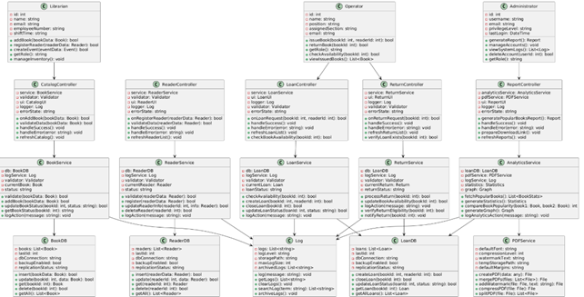
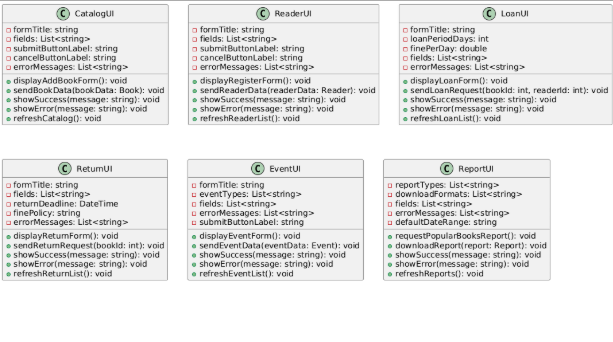
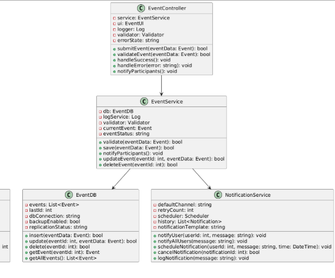
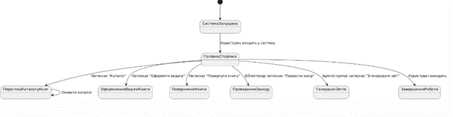
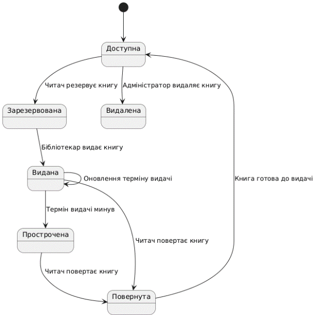
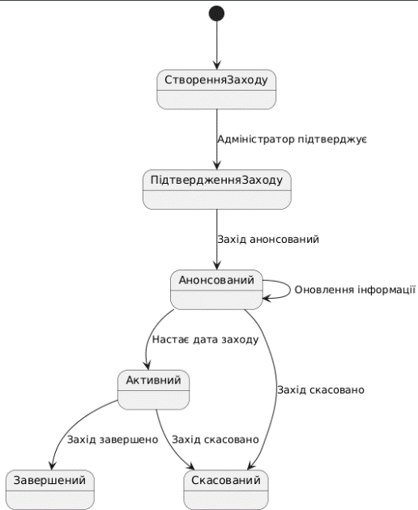
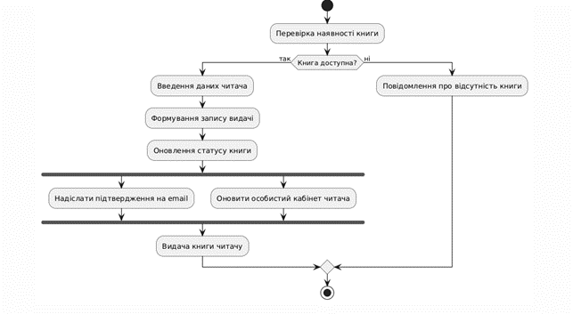
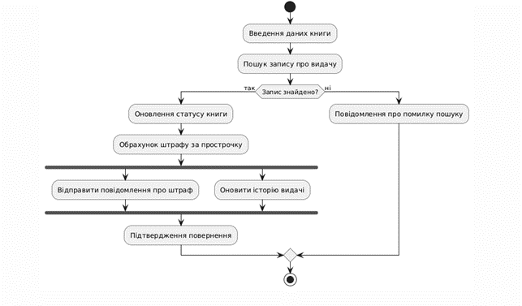
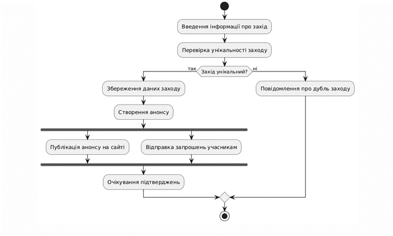
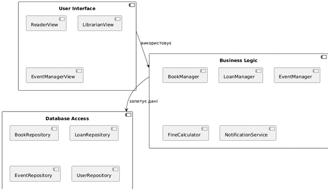

# 1. Побудова діаграм класів (Class Diagrams)

## Завдання
1. Для всіх об’єктів на діаграмах взаємодії призначити (створити) певний клас; для кожного повідомлення призначити (створити) відповідний метод (операцію) для класу об’єкта-приймача.
2. Розташувати створені класи з переліком операцій на діаграмі класів.
3. Для кожної операції визначити атрибути, які вона використовує та при необхідності додати їх до списку атрибутів класу.
4. Для кожного атрибуту задати логічний тип даних, для кожної операції логічний тип даних для return value та для переліку аргументів, якщо вони присутні.
5. Пов’язати класи на діаграмі класів, використовуючи різні типи відношень (асоціацію, агрегацію, композицію, наслідування, інстанціювання).

## Вимоги
- Діаграма класів повинна містити не менше 10 класів.
- Для кожного класу визначити не менше 5 атрибутів та 5 операцій.
- По можливості використати всі типи відношень між класами.

---

# 2. Побудова діаграми станів та переходів (Statechart Diagrams)

## Завдання
Створити одну діаграму станів для опису процесу функціонування обраної системи в цілому і дві діаграми для конкретних елементів системи. Використовувати діаграму станів для авторизації користувачів забороняється.

## Вимоги
- Кожна діаграма повинна містити не менше 6 станів.
- По можливості використати обидва типи переходів (звичайний і рефлексивний).
- Для кожного переходу визначити хоча б одну з характеристик (тригер, гранична умова, дія).

## Діаграми
1. Діаграма станів для всієї системи (Бібліотечна система)

2. Діаграма станів для елемента "Книга"

3. Діаграма станів для елемента "Заходи" (Events)

---

# 3. Побудова діаграм діяльності (Activity Diagrams)

## Завдання
Побудувати 3 діаграми діяльності для окремих варіантів використання системи.

## Вимоги
- Кожна діаграма повинна містити не менше 6 діяльностей.
- При побудові кожної діаграми використовувати стани прийняття рішення та синхронізації.

## Діаграми
1. Діаграма діяльності для "Оформлення видачі книги"

2. Діаграма діяльності для "Повернення книги"

3. Діаграма діяльності для "Створення заходу в бібліотеці"

---

# 4. Побудова діаграм компонентів (Component Diagrams)

## Завдання
Побудувати діаграму компонентів для обраної програмної системи. Діаграма повинна містити не менше трьох компонентів. Розподілити всі класи між компонентами.

