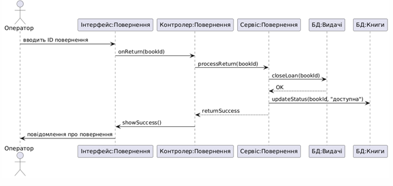

# Use Cases

## Use Case 1: Додати нову книгу до каталогу (Коротка форма)

- **Назва:** Додавання книги  
- **Актор:** Бібліотекар  
- **Опис:** Бібліотекар додає нову книгу до бази даних через інтерфейс системи.  
- **Результат:** Книга з’являється у каталозі з усіма введеними даними.  
- **Попередні умови:** Бібліотекар авторизований у системі.  
- **Післяумови:** Каталог оновлено, книга доступна для пошуку та видачі.  

---

## Use Case 2: Реєстрація нового читача (Поверхнева форма)

- **Назва:** Реєстрація читача  
- **Актор:** Бібліотекар  
- **Попередні умови:** Бібліотекар увійшов у систему.  

### Сценарій:
1. Бібліотекар відкриває форму реєстрації.
2. Вводить ім’я, телефон, email, дату реєстрації.
3. Система перевіряє унікальність email.
4. Система зберігає нового читача в базу.

- **Результат:** Новий читач зареєстрований.

---

## Use Case 3: Видача книги читачу (Повна форма)

- **Назва Use Case:** Видача книги читачу  
- **ID:** UC-03  
- **Основний актор:** Оператор / Бібліотекар  
- **Зацікавлені сторони:** Бібліотека, Читач  
- **Попередні умови:** Оператор увійшов у систему. Книга є в наявності. Читач зареєстрований.  
- **Післяумови:** Книга закріплена за читачем, оновлений стан книги.

### Основний сценарій:
1. Оператор відкриває модуль видачі книг.
2. Вибирає читача зі списку або вводить ID.
3. Система відображає дані про читача та поточні заборгованості.
4. Якщо заборгованість відсутня — переходить до вибору книги.
5. Вибирає книгу зі списку або вводить унікальний код.
6. Система перевіряє, чи книга доступна для видачі.
7. Оператор встановлює дату повернення (може бути автоматично).
8. Натискає "Підтвердити видачу".
9. Система оновлює статус книги (видана), додає запис до історії читача.
10. Система надсилає сповіщення на email читача із деталями видачі.

### Альтернативні сценарії:
- **A1: Заборгованість читача**  
  → Система не дозволяє видачу. Відображається попередження.

- **A2: Книга вже видана/загублена/пошкоджена**  
  → Система забороняє видачу, відображається причина.

- **A3: Невірний код книги**  
  → Система повідомляє про помилку, просить повторити введення.

- **A4: Читач не знайдений**  
  → Оператору пропонується зареєструвати нового читача.

- **A5: Система тимчасово недоступна**  
  → З’являється повідомлення про технічну помилку, видача призупинена.

---

# Побудова діаграм UseCases

**Завдання:**  
У середовищі [app.diagrams.net](https://app.diagrams.net) створити діаграму варіантів використання для обраної комп’ютерної системи.  

Діаграма повинна містити:
- усіх акторів (користувачів системи),
- по три варіанти використання для кожного актора,
- усі види зв’язків:
  - unidirectional association,
  - generalization,
  - extend relationship,
  - include relationship.

---

# Побудова діаграм взаємодії (Interaction Diagrams)

**Завдання:**  
Для кожного варіанта використання на Use Case Diagram створити **Sequence** або **Collaboration Diagram**.

Вимоги:
- Не менше **шести діаграм** кооперації та послідовності.
- На кожній діаграмі:
  - головний актор (якщо є),
  - не менше **5 об’єктів**,
  - не менше **10 повідомлень**.
- Загальна сума різних об’єктів у проекті: **12-15 об’єктів**.
- Використовувати різні типи повідомлень: прямі, рефлексивні, зворотні.
- Додавати символи знищення об’єктів.
- Об’єкти та повідомлення повинні мати зрозумілі назви.

---

## Перелік варіантів використання для побудови діаграм:

1. Додавання нової книги (актор: Бібліотекар)

2. Реєстрація нового читача (актор: Бібліотекар)

3. Видача книги (актор: Оператор)

4. Повернення книги (актор: Оператор)

5. Створення події (актор: Бібліотекар)

6. Генерація звіту про популярність книг (актор: Адміністратор)

