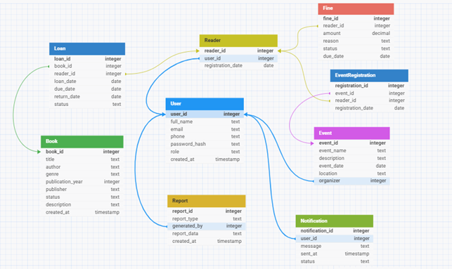

# Формальний опис вимог

**Замовник:** Керівник бібліотеки

У зв’язку із розширенням бібліотечного фонду та зростанням кількості читачів замовник потребує спеціалізоване програмне забезпечення, яке оптимізує та полегшить управління бібліотекою.

## Основні вимоги:
- **Моніторинг бібліотечного фонду:** автоматизація обліку книг (назва, автор, жанр, рік видання, стан книги тощо).
- **Управління читачами:** реєстрація та ведення обліку читачів, контроль заборгованостей і термінів повернення книг.
- **Облік видачі та повернення:** відстеження історії видачі книг, нагадування про терміни повернення.
- **Планування та облік подій:** організація заходів (презентацій, лекцій, зустрічей з авторами) та ведення списку учасників.
- **Звіти та аналітика:** генерація детальних звітів про активність бібліотеки.

# Функціональні вимоги

## 2.1. Моніторинг бібліотечного фонду

### 📌 Функціонал:
- Додавання, редагування та видалення записів про книги:
  - Назва книги
  - Автор
  - Жанр
  - Рік видання
  - Видавництво
  - Унікальний бібліотечний код
  - Поточний стан книги (доступна, видана, загублена, пошкоджена)
  - Короткий зміст та опис
- Каталогізація книг за жанрами, авторами та іншими атрибутами.
- Пошук книг за назвою, автором, жанром або станом.
- Відстеження змін у стані книг.

### 🖥️ Інтерфейс:
- **Головна сторінка каталогу книг:**
  - Таблиця зі списком книг та фільтрами (автор, жанр, стан).
  - Кнопка “Додати книгу” (відкриває форму введення даних).
- **Сторінка книги:**
  - Відображення повної інформації про книгу.
  - Кнопки “Редагувати” та “Видалити”.

---

## 2.2. Управління читачами

### 📌 Функціонал:
- Реєстрація нового читача із внесенням:
  - Ім’я
  - Контактні дані (телефон, email)
  - Дата реєстрації
- Ведення історії відвідувань та видач книг.
- Контроль заборгованостей та автоматичні нагадування про прострочені книги.

### 🖥️ Інтерфейс:
- **Сторінка читачів:**
  - Таблиця з інформацією про читачів.
  - Фільтр за боржниками.
  - Кнопка “Додати читача” (відкриває форму).
- **Сторінка читача:**
  - Повна інформація про читача.
  - Список поточних та минулих книг.
  - Кнопка “Видати книгу”.

---

## 2.3. Облік видачі та повернення книг

### 📌 Функціонал:
- Реєстрація видачі книги читачу:
  - Дата видачі
  - Запланована дата повернення
- Відмітка про повернення книги та її стан після повернення.
- Автоматичні нагадування про термін повернення.

### 🖥️ Інтерфейс:
- **Сторінка видачі книг:**
  - Поле вибору читача.
  - Поле вибору книги.
  - Автоматичне заповнення дати повернення.
  - Кнопка “Підтвердити”.
- **Список книг, що на руках:**
  - Таблиця з інформацією про видачі.

---

## 2.4. Планування та облік подій

### 📌 Функціонал:
- Додавання та управління подіями (презентації, лекції, зустрічі з авторами).
- Формування списку учасників заходу.
- Відправка запрошень та нагадувань про подію.

### 🖥️ Інтерфейс:
- **Календар подій:** відображає всі заплановані події.
- **Сторінка створення події:** форма для введення даних.
- **Список учасників:** таблиця з читачами, що записалися.

---

## 2.5. Звіти та аналітика

### 📌 Функціонал:
- Генерація звітів про стан бібліотечного фонду.
- Аналітика за популярністю книг та активністю читачів.
- Вивантаження звітів у форматах PDF, CSV.

### 🖥️ Інтерфейс:
- **Головна сторінка звітів:** список доступних звітів.
- **Графіки та діаграми:** для аналітики.
- **Кнопка "Експортувати у PDF".**

---

# Технологічний стек

- 🖥 **Клієнт:** React.js / Vue.js
- ⚙️ **Сервер:** Django (Python) / Node.js (Express)
- 🗄 **База даних:** PostgreSQL / MongoDB
- 📩 **Сповіщення:** Email- та SMS-нотифікації
- 📈 **Графіки та аналітика:** Chart.js

---

# Розмежування прав доступу

Система матиме рівні доступу для різних типів користувачів, щоб забезпечити контрольовану взаємодію з бібліотечною базою.

| Роль                    | Доступ до функціоналу | Опис обмежень |
|--------------------------|-----------------------|---------------|
| **Адміністратор**         | ✅ Повний доступ       | Може додавати, редагувати, видаляти книги, читачів, події, створювати звіти, керувати користувачами. |
| **Бібліотекар**           | ✅ Книги, читачі, видача/повернення книг, події | ❌ Не може видаляти адміністраторів або змінювати глобальні налаштування. |
| **Оператор**              | ✅ Видача та повернення книг, редагування читачів | ❌ Не може додавати нові книги або працювати з аналітикою. |
| **Зареєстрований читач**  | ✅ Перегляд каталогу книг, запис на заходи, перегляд історії своїх книг | ❌ Не може редагувати книги чи змінювати записи інших читачів. |
| **Гість**                 | ✅ Лише перегляд каталогу книг і подій | ❌ Не може записуватися на заходи, брати книги або бачити звіти. |

---

## 6.1. Додаткові правила доступу

✅ **Рівень безпеки:**
- Адміністратори можуть створювати облікові записи бібліотекарів та операторів.
- Оператори можуть працювати тільки з видачею/поверненням книг.
- Читачі можуть переглядати лише власні дані (історію видач).
- Усі дії, пов’язані зі змінами бази даних, журналюються для перегляду адміністратором.

✅ **Система входу:**
- Вхід через логін і пароль.
- Двофакторна автентифікація (для бібліотекарів і вище).
- Використання ролей для визначення доступу до функцій у системі.

✅ **Журналювання дій:**
- Всі дії адміністраторів та бібліотекарів фіксуються у журналі подій.
- Простежується, хто додав, видалив або змінив книгу/читача/подію.

# Схема бази даних

